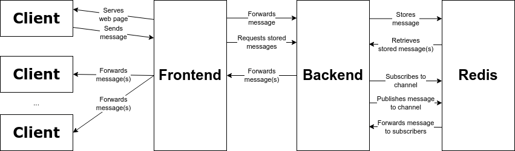

# distributed-chat-app

This is a small distributed chat application (frontend + backend + DB) created as part of a [distributed systems](https://calendars.students.yorku.ca/academic-calendar#/courses/ByScT3yst) course at [York University](https://lassonde.yorku.ca/eecs/). The application was deployed and tested on a small Kubernetes cluster I had previously deployed in Azure Cloud. The chat application supports multi-client and real-time communication using a distributed architecture.

## Requirements
The chat application was implemented in two parts:
- Part I: Starting with an example [chat application](https://github.com/pacslab/chatapp) written in JavaScript/HTML and Python, entirely reimplement the backend in Go language and modify the frontend as needed.
- Part II: Once the solution for Part I is working, extend the chat application to implement one new feature.

The detailed requirements for Part I were as follows:
- Implement a distributed chat application that supports multi-client and real-time communication using Go. When a client sends a new message, other clients can see it immediately.
- Use the WebSocket protocol to achieve real-time communications.
- The chat application should have a web user interface where users can read and send messages.
- Each message should at least contain the following information: Name of the sender, Email of the sender, Time when the message was sent, Topic of the message, and Content of the message.
- Define Kubernetes objects in chatapp.yaml to properly coordinate components of the application. Use node port `30222` to expose the web user interface.
- After running the appropriate Kubernetes commands, the web user interface should be accessible at `http://MASTER_IP:30222`

For Part II, I implemented **ephemeral messaging**, which had the following additional requirements:
- Provide the ability to send ephemeral messages. Such messages will not be stored on the server, and they will just be broadcast in real-time to whoever has the web user interface open and receiving messages now.

## System Architecture
### Overview
The chat application consists of three components:
- A frontend application that provides the user interface and submits messages to the backend via a Websocket;
- A backend server that processes the messages sent by the frontend (via HTTP POST request) and forwards the messages on to all connected clients via their respective Websockets; and
- A Redis server that stores the messages and provides a publish-subscribe (pubsub) facility that allows all connected clients to receive messages in real time.

The following diagram provides a high-level overview of the components of the chat application and shows the connections between them.

### Frontend
The two notable changes from the reference frontend implementation are:
- Removal of the UWSGI settings from the Nginx configuration file and replacement of these settings with a standard reverse proxy configuration that also enables the upgrade to a Websocket connection.
- Addition of a checkbox to the user interface to enable the user to select/deselect sending ephemeral messages.

Primarily, the frontend consists of a graphical user interface that is implemented as a web page in Javascript/HTML. The web page is simple and contains a HTML form with the following message fields: name of the sender, email of the sender, topic of the message, and content of the message. The time of the message is not set by the frontend but instead appended directly to the message when it is received by the backend. Once the fields are populated by the user, the `submit` button on the web page encapsulates all the form information in a single MultiPart Form object, which is sent to the backend via a HTTP POST request.

The web page containing the user interface is served by an Nginx web server. Nginx listens for connections on port `4222` and the configuration has two endpoints:
- The root `/` endpoint serves the user interface to clients that connect via a standard web browser.
- The `/chatapp` endpoint provides a reverse proxy that enables messages to be submitted via the Javascript/HTML application to the frontend but then have these messages forwarded to the backend. As these messages are forwarded, the appropriate HTTP headers are set such that the connection can be upgraded to a Websocket connection.

The Nginx server can serve multiple clients at once. Each client establishes its own connection to the Nginx server and messages sent by a client are forwarded to the backend via the reverse proxy. There is also some Javascript logic in the frontend that automatically requests copies of historical messages from the backend that have been stored (i.e., in Redis). These requests occur when the web page is first loaded, reloaded or when the page scrolls.

### Backend
The backend is implemented in Go and uses the [Gorilla](https://github.com/gorilla/websocket) library for its Websocket implementation and the [go-redis](https://github.com/redis/go-redis/) library for the Redis client implementation. The backend receives (1) new messages and (2) requests for historical messages from the frontend. These two types of requests are handled by different endpoints:
- The `/chatapp/send` endpoint is a standard HTTP endpoint that accepts POST requests that forward a new chat message from a client via the frontend reverse proxy. The message encapsulates a MultiPart Form object, which contains the following data: name of the sender, email of the sender, topic of the message, and content of the message. The Go handler for this endpoint retrieves these data from the Form object, converts the data to a Go object and appends current time/date. The message object is then (optionally) stored in Redis and published to the Redis “messages” channel (as discussed below).
- The `/chatapp/websocket` endpoint accepts a standard HTTP connection but then upgrades the connection to use the Websocket protocol. Once established, the Websocket is a two-way connection. The frontend sends requests to the backend for stored messages via the Websocket. Conversely, the backend forwards both stored and broadcast messages to the frontend via the same Websocket.

Requests from the frontend to the backend are handled concurrently by the backend server. Each new connection to the backend has its own instance of the endpoint handler, which establishes a unique Websocket for the frontend and backend to use. 

Additionally, the backend establishes connections to Redis. These connections serve two purposes:
- When a new frontend connection is established, the backend connection handler is independently subscribed to the Redis `messages` channel so that it can receive new messages sent by other clients in real time. These new messages are forward to the frontend via the Websocket.
- New messages received by the backend are sent to Redis to be stored (unless they are marked as ephemeral messages; see Section 3). New messages are also published to the Redis `messages` channel, which enables subscribed handlers in the backend to receive/forward the messages.

### Redis
The Redis component is an unmodified copy of the official Redis Docker image, which was retrieved from the public Docker image registry. As noted, it provides two important services to the backend:
- It stores a copy of any new message forwarded to it from the backend.
- It provides a publish-subscribe (pubsub) service that allows different backend handlers operating concurrently to subscribe to the same `messages` channel provided by Redis and to receive any messages forwarded to that channel (i.e., by other backend handlers).

### Containerization
Each of the three components of the chat application (frontend, backend, Redis) has been built into its own Docker image. The Docker images were uploaded to a private Docker registry. The Kubernetes chatapp.yaml manifest file supplied with the example chat application was then suitably modified to refer to these three Docker images on the private Docker registry. This configuration is what makes the chat application distributed. Each of the three components becomes its own Kubernetes Deployment that has the specified number of pods, which are deployed based on the Docker images. The pods communicate with each other via the network, which is managed by the Kubernetes middleware.

## Enhancement: Ephemeral Messages
### Implementation
As noted, the backend component of the chat application uses the pubsub facility of Redis to publish and receive new messages in real time. This makes it straightforward to implement the ephemeral messages by simply avoiding the functionality that saves the messages in the Redis data store. To achieve this, two key modifications were made:
- First, the HTML of the frontend interface was modified to add a checkbox that can be optionally selected to mark whether a message is ephemeral or not. Helpfully, the Javascript code of the frontend was general enough that no other modifications were required in the frontend. The frontend simply sends all components of the HTML form (i.e., including the new checkbox) as part of the same POST request to the backend.
- Second, the backend logic for the /chatapp/send endpoint was updated to: (1) check whether the ephemeral checkbox was set in the submitted form; and (2) avoid sending the message to the Redis data store if the ephemeral checkbox was set. Importantly, all messages (ephemeral or not) are still published to the Redis “messages” channel, which ensures that all messages are still immediately received by connected clients.

### Testing
To validate the performance of the ephemeral messages feature, the following testing strategy is suggested:
- Connect a single client (Alice) to the frontend and send a regular (non-ephemeral message). Confirm that this message is received by the client.
- With Alice still connected, connect a second client (Bob) to the frontend. When the frontend user interface loads, historical messages will be automatically retrieved from the Redis store. Confirm that the message from Alice is displayed for Bob.
- Have Bob send an ephemeral message by checking the corresponding checkbox. Confirm that Alice receives this message.
- Connect a third client (Eve) and confirm that only one historical message is loaded. That is, Eve should see the first message sent by Alice but not the second (ephemeral) message sent by Bob since she was not connected to the chat application when this message was sent.

The following screenshots demonstrate the sequence of messages described above.

 message with only one client connected (Alice)")

 message with only two clients connected (Alice, Bob)")

 message with only two clients connected (Alice, Bob)")

 but only two (Alice, Bob) see the previous ephemeral message")
